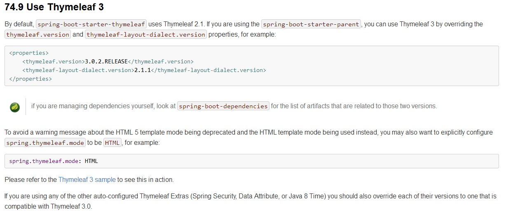

```xml
<dependency>
    <groupId>org.springframework.boot</groupId>
    <artifactId>spring-boot-starter-thymeleaf</artifactId>
</dependency>
```

    此时的thymeleaf默认是2版本，而3版本比2版本速度和写法上优化，本次教学讲使用3版本

查看[springboot文档](https://docs.spring.io/spring-boot/docs/1.5.19.BUILD-SNAPSHOT/reference/htmlsingle/#howto-use-thymeleaf-3)

